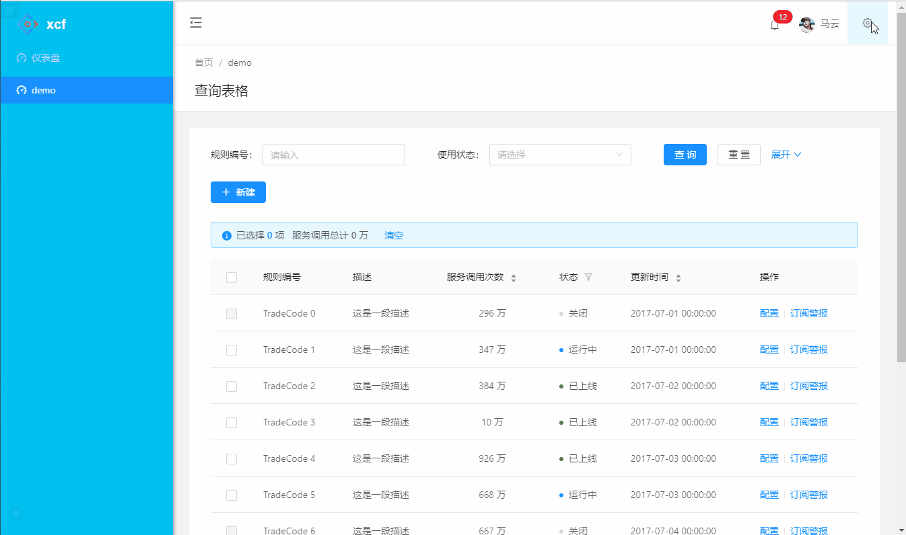

# antd-admin-demo

基于ant design框架的开箱即用的中台前端/设计解决方案。
增加左菜单和顶部菜单的切换、多种主题颜色的切换

## ant帮助

- 预览：http://preview.pro.ant.design
- 首页：http://pro.ant.design
- antd：http://ant.design

## 特性

- :gem: **优雅美观**：基于 Ant Design 体系精心设计
- :triangular_ruler: **常见设计模式**：提炼自中后台应用的典型页面和场景
- :rocket: **最新技术栈**：使用 React/dva/antd 等前端前沿技术开发
- :iphone: **响应式**：针对不同屏幕大小设计
- :art: **主题**：可配置的主题满足多样化的品牌诉求
- :globe_with_meridians: **国际化**：内建业界通用的国际化方案
- :gear: **最佳实践**：良好的工程实践助您持续产出高质量代码
- :1234: **Mock 数据**：实用的本地数据调试方案
- :white_check_mark: **UI 测试**：自动化测试保障前端产品质量

## 使用

```bash
$ npm install
$ npm start               # 访问 http://localhost:8000
```

